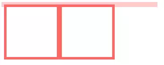
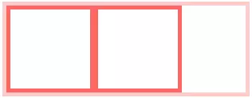

## 盒模型(box model)

首先需要理解什么是[盒模型](https://developer.mozilla.org/en-US/docs/Learn/CSS/Introduction_to_CSS/Box_model)

> The CSS box model is the foundation of layout on the Web — each element is represented as a rectangular box, with the box's content, padding, border, and margin built up around one another like the layers of an onion.

根据 MDN 文档，可以知道盒模型是 Web `布局的基础`，每个 DOM 元素可以看成一个矩形盒子结构。


`width` 和 `height` 描述盒子 `content-box` 的宽和高。content-box 是盒子的内容区域，内容包括了文本内容和其它嵌套子元素的盒子。

`padding` 是盒子的内边界（content-box 外边缘和 border-box 内边缘之间）

`border` 是盒子的外边界（border-box 和外边缘和 margin 内边缘之间），默认外边距的值是 0。可以分别对四个边界设置对应的宽度、样式和颜色。

所以获得一个盒子的宽高，需要计算 border + padding + width/height，我们可以通过设置 `box-sizing` 为 `border-box` 改变宽高的计算方式。


`margin` 是盒子的边距，用于和其他盒子保持一定距离。

> margin 会存在边距塌陷的问题 margin collapsing，即计算两个上下紧靠着的盒子的边距取最大值，而不是相加。

通常情况下 `background-color/background-image` 作用于 `border` 内部区域（包括 border）。可以通过 `background-clip` 改变这种情况。

如果 content-box 的内容大于外部窗口，会出现滚动条，从而看到溢出部分的内容。可以通过 `overflow` 进行调节。

盒模型通过 `display` 被分成 `block`、`inline`、`inline-block` 三种主流的类型。

## 视觉格式化模型(visual formatting model)

> The CSS visual formatting model is an algorithm that processes a document and displays it on visual media.

简单来说，就是将 DOM 渲染到对应媒体上的算法。

当 display 设置为 `block`、`list-item`、`table` 时，这个元素被称为块级(block-level)。一个块级元素会被视觉格式化为`块级盒子`。每个块级盒子会受块格式上下文(block formatting context)影响。每个`块级元素`至少生成一个`块级盒子`。

## 块格式上下文(block formatting context)

BFC 就是一个沙盒，不被外界影响也不影响外界的一个环境。

创建 BFC 的方式

- 根元素或其它包含它的元素
- 浮动 (元素的float不为none)
- 绝对定位元素 (元素的position为absolute或fixed)
- 行内块inline-blocks(元素的 display: inline-block)
- 表格单元格(元素的display: table-cell，HTML表格单元格默认属性)
- overflow的值不为visible的元素
- 弹性盒 flex boxes (元素的display: flex或inline-flex)

具体使用场景：

### 1.避免和浮动元素重叠

```html
<style>
    .aside {
        width: 100px;
        height: 150px;
        float: left;
        background: #f66;
    }
    .main {
        height: 200px;
        background: #fcc;
    }
</style>
<body>
    <div class="aside"></div>
    <div class="main"></div>
</body>
```


当前 main 不处于 BFC 环境下，我们可以设置 overflow 让其进入 BFC

```css{2}
.main {
    overflow: auto;
}
```


### 2.清楚元素内部浮动

```html
<style>
    .par {
        border: 5px solid #fcc;
        width: 300px;
    }
    .child {
        border: 5px solid #f66;
        width:100px;
        height: 100px;
        float: left;
    }
</style>
<body>
    <div class="par">
        <div class="child"></div>
        <div class="child"></div>
    </div>
</body>
```



```css
.par{
  overflow: auto;
}
```



### 3.防止垂直 margin 塌陷

```html
<style>
    .child {
        margin: 10px 0;
        overflow: auto;
    }
</style>
<body>
    <div class="child"></div>
    <div class="child"></div>
</body>
```
