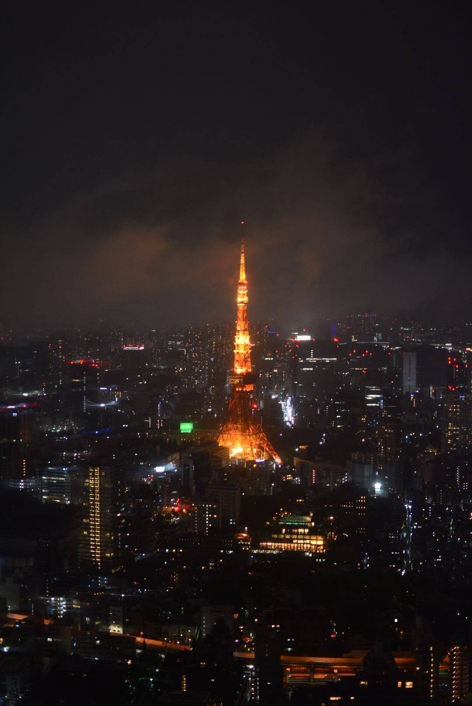

五一假期和女友去了趟东京和镰仓，这也是我第二次出国。对日本有了切身体会的初次认识。

---

## 城市干净

这个应该是所有国人刚到日本的第一印象吧，整个东京给我的感觉就是**一尘不染**。即便是施工场地，也会用布整个围起来，减少大量的灰尘和噪音。雨天进入地铁，大家也会很自觉地把伞收起来用甚至用塑料袋装，避免地上积水。

在日本很难找到垃圾桶，而且垃圾是分类的，有时候想丢一个塑料瓶，但是只找到一个回收纸的垃圾桶，也没有办法。大部分人选择出门带塑料袋把垃圾带回家。这一点也让我有些不太习惯，所以去便利店通常也不会拒绝塑料袋，毕竟免费而且可以当做垃圾袋。

## 道路交通

日本的车道很挤，两车道的宽度比国内小很多，而且和杭州一样车也是让人的，但是却没有杭州这么拥挤。

我观察到的原因如下：

1. 大家开车都很遵守交通规则，很少出现超车变道，强行加塞的情况。
1. 如果有救护车过来，前面的车会很默契地让道减速。
1. 行人也很遵守交通规则，自行车不会抢道也没有电瓶车，汽车车速会比国内快。
1. 车让人的情况，行人会快速通过，不像在杭州，很多行人是肆无忌惮边玩手机边过马路。
1. 日本人的车真的都很小，和奇瑞 QQ 大小接近。

然后再说说东京的地铁，和天朝比起来各有优缺点：

优点：

1. 不用安检，极大提升效率，减少麻烦。
1. 地铁线路密集，比上海还要密集，出行很方便。
1. 多个城市间的地铁互通，你可以乘坐地铁到周边的城市。
1. 地铁和火车也是联通的，有时候我都分不清自己坐的是地铁还是火车。
1. 座位舒服，比国内的舒服很多。

缺点：

1. 价格比国内贵很多当然打车更贵，可能相对于他们的收入水平应该不算贵。（可能是我的缺点）
1. 线路过于复杂，同一条线有很多种路线，同一班车可能到下一个站就是另外一条线了。第一天在羽田机场就坐反到川崎。
1. 换乘成本高，线路换乘往往需要出站，然后走很长一段路到另外一个地铁入口换乘，而且价格另算。
1. 每条线的价格不一样，有些价格会贵很多。

## 宅男文化

第一次来带秋叶原，带给我很强烈的宅男文化。各种 ACG 周边，以及整栋楼的动漫海报，还特意去了成人用品的大楼感受下日本的成人产业。只能感叹日本宅男生活真的很丰富。日本的宅男文化年龄层跨度比较大，在秋叶原你可以看到油腻的胖大叔，也可以看到结伴的小学生。当然我是分不清所谓的平成废宅、丧文化之类的术语关联，甚至没有过多的去了解日本历史，也就不发表太多个人意见。

## 饮食

一开始对日本人的口味印象是清淡，但是第一次不小心吃了东京风的浓汤豚骨拉面后改观，除了咸味忘记了其它味道。后来得知东京人口味偏咸，不过对于我来说还是不太能接受，不过这也是我仅发现的一个重口味地方。

总共吃了两次和牛，体验到什么叫入口即化。第一次是和牛盖饭，玉子混合着生和牛，真的是绝配。第二次是烤和牛，百分百纯和牛盛宴。不过两次吃到最后都发现有点腻，大概是和牛丰富的脂肪导致的吧。总结下来就是和牛虽然口感极佳，却很难吃太多。（而且价格也不便宜）

同时也吃了两顿回转寿司，寿司店最大的印象就是气氛很活跃，虽然听不懂日语。**米饭 + 新鲜的食材**真的是容易让我忘记自己吃了多少。

在东京饮食消费和上海日料店差不多，但是味道当然是东京更正宗。鳗鱼饭、豚骨拉面这些都是很日常的饮食，相比国内日常饮食，消费水平应该是高一倍。

## 小结

这次日本之行，刚好也赶上了天皇换位，还是挺有纪念意义的。也是我去的第一个发达国家，有了更多零距离的接触。未来的一年，我更多的关注点可能会放在国内没去过的城市。
